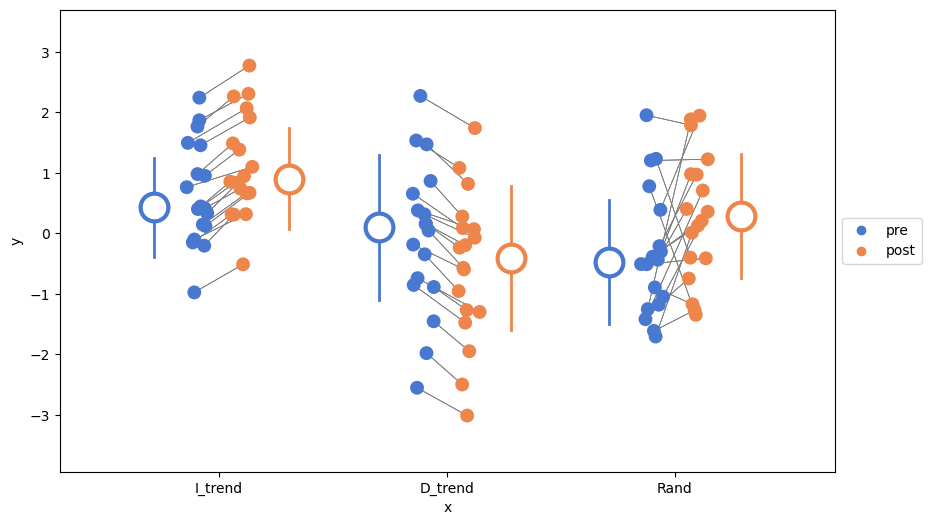

# lineNdots

[](https://opensource.org/licenses/MIT)

## Introduction
**lineNdots** is a Python toolbox to create beautiful and meaningful plots, especially for longitudinal data (e.g., repeated measures experiments with pre and post or multiple conditions). It is inspired by the [RainCloud](https://github.com/njudd/ggrain) is an inspiration for having beautiful and meaningful plots, especially for longitudinal data (e.g., repeated measures experiments with pre and post or multiple conditions). However, there are some drawbacks especially for the Python version of the RainCloud plots that made me work on lineNdots:

1. The longitudinal aspect is not complete in the Python version of RainCloud. The R version nicely provide hairline plots between individual data point for the longitudinal data. However, the Python version lacks this feature.
2. KDEs and box plots are not always the best visualization. While KDEs are very nice and informative when there is a good amount of data points (>30), for smaller distributions, which is often the case in biomechanics, they can be misleading. Further, box plots mainly reflect the median and IQRs and the range of the data, whereas the statistical tests performed on the data are usually comparing the mean and standard deviation. This creates a discrepancy between the statistics and the presented data. The problem sis more pronounced with smaller populations as there would be possibly bigger difference between the median and mean.

lineNdots tries to address these two main issues. Further, I have tried to work mainly within the boundaries of the Seaborn toolbox and manipulated its variables to achieve my plots. So, as long as you can pass the data as a Seaborn stripplot, you should also be able to plot lineNdots, without additional arguments. However, you can control lineNdots and override its defaults with additional arguments. Here are the synopsis the features of the lineNdots toolbox:

1. Longitudinal data are connected by individual hairlines, unless set to False.
2. KDEs are removed. Box plots are replaced by a central dot and line, which by default indicate average and STE.
3. The values ventral dot and the lines can be changed to median and IQR or any other quantity. Just pass the function.
4. Change anything on the plot, like the size of the dots, the width of the lines, the color of the lines, etc.
5. Enjoy using Seaborn's awesome color pallets and features. lineNdots just moves Seaborn elements around.
6. Change elements of the plot as you would with Seaborn, like the axis labels, the title, etc. with the same Seaborn commands.

## Installation
Pull from this repo, unzip the directory. Open a Terminal window and navigate to the directory. Then install using `pip`:

```shell
pip install .
```

## How to use
Similar to a stripplot, plot using lineNdots:

```Python
from lineNdots import lnd

lnd(
    data, 'y', 'hue', 'x', palette=palette, agg_function=np.median, var_function=np.std,
    ax=ax, colors=None, line=True, dots=True, flipped=True, legend=True,
    verbose=False, adtnl_space=0.1, mean_size=20, size=10, lw=2, hairlines=True, hairline_style='-'
)
```

The arguments are similar to the Seaborn stripplot, with some additional arguments.

Output:



#### See the sample notebook in the `scripts` directory.

## Development path
Upon completion!, lineNdots should be able to function similar to ggrain, but in Python. To achieve this goal, we need smaller steps:

- [x] control of the `stripplot` on left or right, as well as flipping them with longitudinal data
  - `rain.side: Which side to display the rainclouds: 'l' for left, 'r' for right and 'f' for flanking`
- [x] It is all about the **hairlines**.
- [x] make center dot and lines customizable.
- [ ] create unit tests
- [ ] ~~afford complex plots, like the following ggrain feature set: `id.long.var, cov, y-jittering`~~ (will not be implemented soon)
- [ ] create documentation
- [ ] release beta and get feedback
